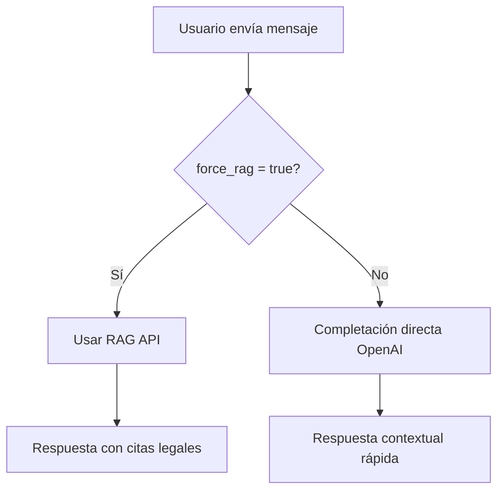

# Question Chat Edge Function

Sistema de chat contextual para preguntas de examen con integración opcional de RAG (Retrieval-Augmented Generation).

## Arquitectura

### Modo por Defecto: Completación Directa con OpenAI
Por defecto, la edge function usa **completaciones directas de OpenAI** basadas en el contexto de la pregunta, sin acceder a la base de datos legal (RAG).

**Ventajas:**
- ✅ Respuestas rápidas (1-2 segundos)
- ✅ Conversaciones naturales y contextuales
- ✅ Menor coste operativo
- ✅ Perfecto para explicar opciones, ayudar con la comprensión, etc.

### Modo RAG: Búsqueda Legal (Opcional)
El usuario puede **forzar el uso de RAG** cuando necesita información legal específica mediante el parámetro `force_rag: true`.

**Ventajas:**
- ✅ Acceso a base de datos legal completa
- ✅ Referencias legales precisas con citas
- ✅ Información actualizada de leyes y códigos
- ⚠️ Mayor tiempo de respuesta (10-60 segundos)
- ⚠️ Mayor coste por consulta

## API Request

```typescript
interface QuestionChatRequest {
  question_id: number
  message?: string
  user_answer?: number
  user_test_id?: number
  include_user_stats?: boolean
  extra_context?: string
  force_rag?: boolean  // 🔑 NUEVO: Fuerza uso de RAG API
}
```

### Ejemplos de Uso

#### 1. Consulta Normal (Sin RAG - Por Defecto)
```bash
curl -X POST 'http://localhost:54321/functions/v1/question-chat' \
  -H 'Authorization: Bearer YOUR_JWT_TOKEN' \
  -H 'Content-Type: application/json' \
  -d '{
    "question_id": 1,
    "message": "No entiendo por qué la opción 2 es correcta"
  }'
```

**Respuesta:** Explicación basada en el tip/contexto de la pregunta usando OpenAI directamente.

#### 2. Consulta con Búsqueda Legal (Con RAG)
```bash
curl -X POST 'http://localhost:54321/functions/v1/question-chat' \
  -H 'Authorization: Bearer YOUR_JWT_TOKEN' \
  -H 'Content-Type: application/json' \
  -d '{
    "question_id": 1,
    "message": "¿Qué dice el artículo 17 de la Constitución sobre esto?",
    "force_rag": true
  }'
```

**Respuesta:** Búsqueda en base de datos legal con citas y referencias precisas.

## Flujo de Decisión



## Logs y Debugging

### Log de Decisión de Routing
```
🎯 Routing decision: Direct OpenAI completion
💭 Reasoning: Modo por defecto: completación directa con OpenAI (sin RAG)
```

O cuando se fuerza RAG:
```
🎯 Routing decision: Use RAG API
💭 Reasoning: Usuario solicitó explícitamente uso de RAG (force_rag=true)
```

### Metadata en Mensajes
Cada mensaje guardado incluye en su metadata:
- `routing_decision`: Razón de la decisión de routing
- `force_rag`: Si el usuario forzó el uso de RAG
- `source`: Origen de la respuesta (`openai_direct` o `rag_api`)

## Configuración

### Variables de Entorno
```env
OPEN_AI_KEY=sk-proj-...
RAG_API_URL=https://rag-legal-api-...
```

### OpenAI Model
- Completaciones directas: `gpt-5-mini` (rápido y económico)
- Temperature: `0.7` (conversacional pero consistente)
- Max tokens: `800` (respuestas concisas)

## Testing

### Test 1: Modo Normal (Sin RAG)
```bash
{
  "question_id": 1,
  "message": "Hola, ¿puedes explicarme esta pregunta?"
}
```
Respuesta esperada: Explicación amigable usando el contexto de la pregunta.

### Test 2: Modo RAG
```bash
{
  "question_id": 1,
  "message": "¿Qué dice el Código Penal sobre este tema?",
  "force_rag": true
}
```
Respuesta esperada: Búsqueda legal con citas y referencias.

## Performance

| Modo | Tiempo Respuesta | Coste Estimado | Uso Recomendado |
|------|-----------------|----------------|-----------------|
| Direct OpenAI | 1-2s | Bajo | Explicaciones, ayuda general |
| RAG API | 10-60s | Alto | Consultas legales específicas |

## Mejoras Futuras

- [ ] Caché de respuestas frecuentes
- [ ] Detección automática de necesidad de RAG (opcional)
- [ ] Streaming de respuestas para mejor UX
- [ ] Historial conversacional con contexto completo
