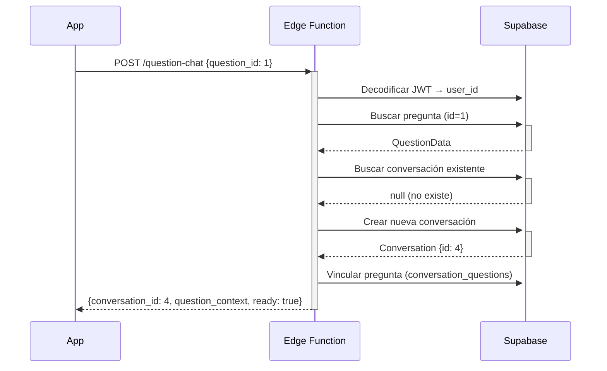
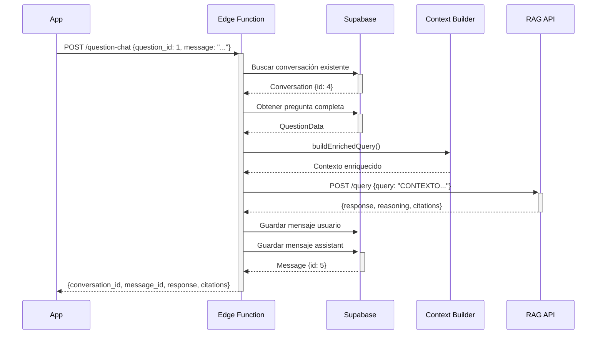

# 📚 Documentación Completa: Edge Function `question-chat`

## 📋 Índice
1. [Visión General](#visión-general)
2. [Arquitectura](#arquitectura)
3. [Base de Datos](#base-de-datos)
4. [Autenticación](#autenticación)
5. [API Endpoints](#api-endpoints)
6. [Flujo de Datos](#flujo-de-datos)
7. [Integración con la App](#integración-con-la-app)
8. [Casos de Uso](#casos-de-uso)
9. [Manejo de Errores](#manejo-de-errores)

---

## 🎯 Visión General

La edge function `question-chat` proporciona un sistema de **chat contextual con IA** para ayudar a los usuarios a entender preguntas de test de oposición de Guardia Civil. Integra:

- ✅ **RAG (Retrieval-Augmented Generation)**: Respuestas basadas en legislación oficial
- ✅ **Contexto de usuario**: Historial de respuestas y rendimiento
- ✅ **Conversaciones persistentes**: Una conversación por pregunta
- ✅ **Autenticación WordPress**: JWT tokens de WordPress

---

## 🏗️ Arquitectura

### Estructura de Carpetas

```
question-chat/
├── index.ts                    # Punto de entrada principal
├── models/                     # Tipos TypeScript
│   ├── question.ts            # Modelo de pregunta
│   ├── conversation.ts        # Modelo de conversación/mensajes
│   ├── user_performance.ts    # Modelo de rendimiento
│   ├── request.ts             # Request/Response API
│   └── rag_api.ts             # Tipos RAG API
├── repositories/              # Acceso a datos
│   ├── supabase_repository.ts # Queries Supabase
│   └── rag_api_repository.ts  # Cliente RAG API
└── utils/
    └── context_builder.ts     # Constructor de contexto
```

### Patrón Repository

Cada repository encapsula el acceso a una fuente de datos:
- **SupabaseRepository**: CRUD de preguntas, conversaciones, mensajes, rendimiento
- **RAGApiRepository**: Llamadas al servicio RAG externo

---

## 🗄️ Base de Datos

### Tablas Involucradas

#### 1. `users`
Usuarios de la aplicación (sincronizados con WordPress).

```sql
CREATE TABLE users (
  id BIGINT PRIMARY KEY,           -- ID del usuario en WordPress
  username TEXT NOT NULL,
  email TEXT NOT NULL,
  totalQuestions INT DEFAULT 0,    -- Total de preguntas respondidas
  rightQuestions INT DEFAULT 0,    -- Preguntas acertadas
  wrongQuestions INT DEFAULT 0,    -- Preguntas falladas
  created_at TIMESTAMP DEFAULT NOW()
);
```

**Relaciones**:
- `conversations.user_id` → `users.id`
- `user_tests.user_id` → `users.id`

---

#### 2. `questions`
Preguntas del banco de preguntas de oposición.

```sql
CREATE TABLE questions (
  id SERIAL PRIMARY KEY,
  question TEXT NOT NULL,          -- Enunciado de la pregunta
  tip TEXT,                        -- Explicación oficial (opcional)
  difficult_rate DECIMAL(3,2),     -- Dificultad 0-10
  topic INT,                       -- FK a tabla topic
  created_at TIMESTAMP DEFAULT NOW()
);
```

**Relaciones**:
- `questions.topic` → `topic.id`
- `question_options.question_id` → `questions.id`
- `conversation_questions.question_id` → `questions.id`

---

#### 3. `question_options`
Opciones de respuesta para cada pregunta.

```sql
CREATE TABLE question_options (
  id SERIAL PRIMARY KEY,
  question_id INT NOT NULL,        -- FK a questions
  answer TEXT NOT NULL,            -- Texto de la opción
  is_correct BOOLEAN DEFAULT false,-- Si es la respuesta correcta
  option_order INT NOT NULL,       -- Orden de la opción (1-4)
  FOREIGN KEY (question_id) REFERENCES questions(id) ON DELETE CASCADE
);
```

**Importante**: `option_order` determina el orden visual (1, 2, 3, 4).

---

#### 4. `topic`
Temas o materias de las preguntas.

```sql
CREATE TABLE topic (
  id SERIAL PRIMARY KEY,
  name TEXT NOT NULL,              -- Nombre del tema
  description TEXT,                -- Descripción
  created_at TIMESTAMP DEFAULT NOW()
);
```

---

#### 5. `conversations`
Conversaciones de chat entre usuario y pregunta.

```sql
CREATE TABLE conversations (
  id SERIAL PRIMARY KEY,
  user_id BIGINT NOT NULL,         -- FK a users
  title TEXT,                      -- Título auto-generado
  system_prompt_id INT,            -- FK a system_prompts (opcional)
  metadata JSONB DEFAULT '{}',     -- Datos adicionales
  status TEXT DEFAULT 'active',    -- 'active' | 'archived'
  created_at TIMESTAMP DEFAULT NOW(),
  updated_at TIMESTAMP DEFAULT NOW(),
  FOREIGN KEY (user_id) REFERENCES users(id) ON DELETE CASCADE,
  FOREIGN KEY (system_prompt_id) REFERENCES system_prompts(id)
);
```

**Características**:
- Una conversación puede estar asociada a múltiples preguntas (N:M via `conversation_questions`)
- El campo `metadata` puede contener información adicional contextual
- Título generado automáticamente por función `generate_conversation_title()`

---

#### 6. `conversation_questions`
Relación N:M entre conversaciones y preguntas.

```sql
CREATE TABLE conversation_questions (
  id SERIAL PRIMARY KEY,
  conversation_id INT NOT NULL,
  question_id INT NOT NULL,
  created_at TIMESTAMP DEFAULT NOW(),
  FOREIGN KEY (conversation_id) REFERENCES conversations(id) ON DELETE CASCADE,
  FOREIGN KEY (question_id) REFERENCES questions(id) ON DELETE CASCADE,
  UNIQUE(conversation_id, question_id)  -- Una pregunta por conversación
);
```

**Uso**: Permite vincular conversaciones con preguntas específicas para contexto.

---

#### 7. `messages`
Mensajes dentro de una conversación.

```sql
CREATE TABLE messages (
  id SERIAL PRIMARY KEY,
  conversation_id INT NOT NULL,
  role TEXT NOT NULL,              -- 'user' | 'assistant'
  content TEXT NOT NULL,           -- Contenido del mensaje
  metadata JSONB DEFAULT '{}',     -- Datos adicionales
  created_at TIMESTAMP DEFAULT NOW(),
  FOREIGN KEY (conversation_id) REFERENCES conversations(id) ON DELETE CASCADE
);
```

**Roles**:
- `user`: Mensaje del usuario
- `assistant`: Respuesta de la IA

**Metadata**: Puede contener datos como:
```json
{
  "rag_response": { ... },
  "citations": [ ... ],
  "reasoning": "..."
}
```

---

#### 8. `user_tests`
Tests/exámenes realizados por usuarios.

```sql
CREATE TABLE user_tests (
  id SERIAL PRIMARY KEY,
  user_id BIGINT NOT NULL,
  score DECIMAL(5,2),              -- Puntuación final
  total_questions INT,
  correct_answers INT,
  wrong_answers INT,
  test_mode TEXT,                  -- Tipo de test
  created_at TIMESTAMP DEFAULT NOW(),
  FOREIGN KEY (user_id) REFERENCES users(id) ON DELETE CASCADE
);
```

---

#### 9. `user_test_answers`
Respuestas individuales de cada pregunta en un test.

```sql
CREATE TABLE user_test_answers (
  id SERIAL PRIMARY KEY,
  user_test_id INT NOT NULL,
  question_id INT NOT NULL,
  answer_index INT,                -- Índice de la opción elegida
  is_correct BOOLEAN,
  answered_at TIMESTAMP DEFAULT NOW(),
  FOREIGN KEY (user_test_id) REFERENCES user_tests(id) ON DELETE CASCADE,
  FOREIGN KEY (question_id) REFERENCES questions(id) ON DELETE CASCADE
);
```

**Uso**: Permite obtener el historial completo de respuestas de un usuario a una pregunta.

---

#### 10. `system_prompts`
Prompts del sistema para diferentes tipos de conversación.

```sql
CREATE TABLE system_prompts (
  id SERIAL PRIMARY KEY,
  slug TEXT UNIQUE NOT NULL,       -- Identificador único
  name TEXT NOT NULL,
  content TEXT NOT NULL,           -- Contenido del prompt
  is_active BOOLEAN DEFAULT true,
  created_at TIMESTAMP DEFAULT NOW()
);
```

**Slug importante**: `test-reviewer` - Usado para conversaciones de preguntas.

---

## 🔐 Autenticación

### WordPress JWT

La edge function usa **JWT tokens de WordPress** para autenticación.

#### Formato del Token

El token JWT debe contener:

```json
{
  "iss": "https://oposicionesguardiacivil.online",
  "iat": 1762628899,
  "nbf": 1762628899,
  "exp": 1763233699,
  "data": {
    "user": {
      "id": "4"        // ⚠️ ID del usuario en WordPress (string)
    }
  }
}
```

**Importante**: El user ID puede estar en:
- `payload.data.user.id` (formato antiguo WordPress)
- `payload.sub` (formato estándar JWT)

#### Configuración

**En WordPress** (`wp-config.php` o plugin JWT):
```php
define('JWT_AUTH_SECRET_KEY', '5pV0uKhiWoMClkrfAZiBc2bPWAPT05trPCB7uYohxW+im7kT9mpZEzQGK/ee5fY/Pg1wfQr/H6MvLWWY6VT6zw==');
```

**En RAG API** (`.env`):
```env
JWT_SIGNATURE=5pV0uKhiWoMClkrfAZiBc2bPWAPT05trPCB7uYohxW+im7kT9mpZEzQGK/ee5fY/Pg1wfQr/H6MvLWWY6VT6zw==
```

**⚠️ Ambas deben usar la MISMA clave**.

---

## 🌐 API Endpoints

### POST `/question-chat`

**Inicializar o enviar mensaje en una conversación**

#### Headers
```http
Content-Type: application/json
Authorization: Bearer {JWT_TOKEN}
```

#### Request Body

```typescript
interface QuestionChatRequest {
  question_id: number;           // ID de la pregunta (REQUERIDO)
  message?: string;              // Mensaje del usuario (opcional)
  user_answer?: number;          // Respuesta del usuario (1-4)
  user_test_id?: number;         // ID del test actual (opcional)
  include_user_stats?: boolean;  // Incluir estadísticas (default: false)
  extra_context?: string;        // Contexto adicional (solo al inicio)
}
```

#### Casos de Uso

##### 1. **Inicializar Conversación** (sin mensaje)

```json
{
  "question_id": 1
}
```

**Respuesta**:
```json
{
  "conversation_id": 4,
  "question_context": {
    "question_id": 1,
    "statement": "Aliqua ut enim ad minim veniam quis?",
    "topic": "Derecho Constitucional",
    "difficulty": 0.5,
    "options": [
      { "order": 1, "text": "In reprehenderit voluptate velit", "is_correct": true },
      { "order": 2, "text": "Veniam quis nostrud exercitation", "is_correct": false },
      { "order": 3, "text": "Sunt in culpa qui officia", "is_correct": false },
      { "order": 4, "text": "Unde omnis iste natus", "is_correct": false }
    ],
    "correct_answer": { "order": 1, "text": "In reprehenderit voluptate velit" },
    "user_answer": null,
    "tip": "Explicación oficial..."
  },
  "ready": true,
  "message": "Conversation ready. Send a message to start chatting."
}
```

##### 2. **Enviar Mensaje con Contexto de Respuesta**

```json
{
  "question_id": 1,
  "message": "¿Por qué la opción 1 es correcta?",
  "user_answer": 1
}
```

**Respuesta**:
```json
{
  "conversation_id": 4,
  "message_id": 5,
  "response": "La opción 1 es correcta porque...",
  "reasoning": "Razonamiento del modelo...",
  "citations": [
    {
      "law_title": "Constitución Española",
      "item_title": "Artículo 10",
      "content": "La dignidad de la persona...",
      "url": "https://www.boe.es/..."
    }
  ],
  "performance_context": {
    "user_stats": {
      "total_questions": 50,
      "right_questions": 35,
      "wrong_questions": 15,
      "accuracy": 70
    },
    "question_performance": {
      "times_answered": 3,
      "times_correct": 2,
      "times_wrong": 1,
      "last_answer": {
        "answer_index": 1,
        "was_correct": true,
        "test_id": 10,
        "answered_at": "2025-01-15T10:30:00Z"
      }
    }
  }
}
```

##### 3. **Incluir Estadísticas y Test Actual**

```json
{
  "question_id": 1,
  "message": "Explícame esta pregunta",
  "include_user_stats": true,
  "user_test_id": 25
}
```

Incluye información del test actual y rendimiento histórico.

---

### GET `/question-chat/{question_id}`

**Recuperar conversación existente**

```http
GET /question-chat/1
Authorization: Bearer {JWT_TOKEN}
```

**Respuesta**:
```json
{
  "conversation": {
    "id": 4,
    "user_id": 4,
    "title": "Pregunta sobre derechos fundamentales",
    "status": "active",
    "created_at": "2025-01-15T10:00:00Z"
  },
  "messages": [
    {
      "id": 1,
      "role": "user",
      "content": "¿Por qué la opción 1 es correcta?",
      "created_at": "2025-01-15T10:01:00Z"
    },
    {
      "id": 2,
      "role": "assistant",
      "content": "La opción 1 es correcta porque...",
      "created_at": "2025-01-15T10:01:05Z"
    }
  ]
}
```

---

## 🔄 Flujo de Datos

### 1. Inicialización de Conversación



### 2. Envío de Mensaje con RAG



### 3. Context Builder - Query Enriquecido

El `buildEnrichedQuery()` construye un contexto completo:

```text
CONTEXTO DE PREGUNTA DE TEST - OPOSICIÓN GUARDIA CIVIL

📚 TEMA: Derecho Constitucional
⚡ DIFICULTAD: 5/10

❓ ENUNCIADO: ¿Cuál es la estructura del Estado según la Constitución?

📝 OPCIONES:
1. Estado social y democrático de Derecho ✅ CORRECTA
2. Estado federal
3. Estado confederal
4. Estado totalitario

👤 RESPUESTA DEL USUARIO (sesión actual): Opción 1 - Estado social y democrático de Derecho
✅ CORRECTA

📖 EXPLICACIÓN OFICIAL: La Constitución Española establece en su artículo 1...

📊 RENDIMIENTO DEL USUARIO:
• Precisión general: 70% (35/50 preguntas)

📈 HISTORIAL EN ESTA PREGUNTA ESPECÍFICA:
• Intentos totales: 3
• Aciertos: 2 | Fallos: 1
• Último intento: CORRECTA ✅

📝 TEST ACTUAL (ID: 25):
• Progreso: 15/20 preguntas
• Aciertos: 12 | Fallos: 3
• Nota actual: 7.50
• Esta pregunta en el test: ACERTADA ✅

💬 PREGUNTA DEL USUARIO: ¿Por qué la opción 1 es correcta?
```

---

## 📱 Integración con la App (Flutter)

### Configuración Inicial

#### 1. Configurar Variables de Entorno

```dart
// lib/config/environment.dart
class Environment {
  static const supabaseUrl = 'https://tu-proyecto.supabase.co';
  static const supabaseAnonKey = 'eyJhbGciOiJ...';
  static const questionChatEndpoint = '/functions/v1/question-chat';
}
```

#### 2. Cliente Supabase

```dart
import 'package:supabase_flutter/supabase_flutter.dart';

await Supabase.initialize(
  url: Environment.supabaseUrl,
  anonKey: Environment.supabaseAnonKey,
);

final supabase = Supabase.instance.client;
```

### Servicio de Chat

```dart
// lib/services/question_chat_service.dart

class QuestionChatService {
  final SupabaseClient _supabase;
  final String _jwtToken; // Token de WordPress

  QuestionChatService(this._supabase, this._jwtToken);

  /// Inicializar conversación con una pregunta
  Future<QuestionChatResponse> initializeConversation(int questionId) async {
    final response = await _supabase.functions.invoke(
      'question-chat',
      method: HttpMethod.post,
      headers: {
        'Authorization': 'Bearer $_jwtToken',
      },
      body: {
        'question_id': questionId,
      },
    );

    if (response.status != 200) {
      throw Exception('Failed to initialize conversation');
    }

    return QuestionChatResponse.fromJson(response.data);
  }

  /// Enviar mensaje en la conversación
  Future<QuestionChatResponse> sendMessage({
    required int questionId,
    required String message,
    int? userAnswer,
    int? userTestId,
    bool includeUserStats = false,
  }) async {
    final response = await _supabase.functions.invoke(
      'question-chat',
      method: HttpMethod.post,
      headers: {
        'Authorization': 'Bearer $_jwtToken',
      },
      body: {
        'question_id': questionId,
        'message': message,
        if (userAnswer != null) 'user_answer': userAnswer,
        if (userTestId != null) 'user_test_id': userTestId,
        'include_user_stats': includeUserStats,
      },
    );

    if (response.status != 200) {
      throw Exception('Failed to send message');
    }

    return QuestionChatResponse.fromJson(response.data);
  }

  /// Obtener conversación existente
  Future<ConversationWithMessages?> getConversation(int questionId) async {
    final response = await _supabase.functions.invoke(
      'question-chat/$questionId',
      method: HttpMethod.get,
      headers: {
        'Authorization': 'Bearer $_jwtToken',
      },
    );

    if (response.status == 404) {
      return null;
    }

    if (response.status != 200) {
      throw Exception('Failed to get conversation');
    }

    return ConversationWithMessages.fromJson(response.data);
  }
}
```

### Modelos Dart

```dart
// lib/models/question_chat_models.dart

class QuestionChatResponse {
  final int conversationId;
  final int? messageId;
  final String? response;
  final String? reasoning;
  final List<Citation>? citations;
  final PerformanceContext? performanceContext;
  final QuestionContext? questionContext;
  final bool? ready;
  final String? message;

  QuestionChatResponse({
    required this.conversationId,
    this.messageId,
    this.response,
    this.reasoning,
    this.citations,
    this.performanceContext,
    this.questionContext,
    this.ready,
    this.message,
  });

  factory QuestionChatResponse.fromJson(Map<String, dynamic> json) {
    return QuestionChatResponse(
      conversationId: json['conversation_id'],
      messageId: json['message_id'],
      response: json['response'],
      reasoning: json['reasoning'],
      citations: json['citations'] != null
          ? (json['citations'] as List)
              .map((c) => Citation.fromJson(c))
              .toList()
          : null,
      performanceContext: json['performance_context'] != null
          ? PerformanceContext.fromJson(json['performance_context'])
          : null,
      questionContext: json['question_context'] != null
          ? QuestionContext.fromJson(json['question_context'])
          : null,
      ready: json['ready'],
      message: json['message'],
    );
  }
}

class Citation {
  final String? lawTitle;
  final String? itemTitle;
  final String? content;
  final String? url;

  Citation({this.lawTitle, this.itemTitle, this.content, this.url});

  factory Citation.fromJson(Map<String, dynamic> json) {
    return Citation(
      lawTitle: json['law_title'],
      itemTitle: json['item_title'],
      content: json['content'],
      url: json['url'],
    );
  }
}

class QuestionContext {
  final int questionId;
  final String statement;
  final String topic;
  final double? difficulty;
  final List<QuestionOption> options;
  final CorrectAnswer correctAnswer;
  final UserAnswer? userAnswer;
  final String? tip;

  QuestionContext({
    required this.questionId,
    required this.statement,
    required this.topic,
    this.difficulty,
    required this.options,
    required this.correctAnswer,
    this.userAnswer,
    this.tip,
  });

  factory QuestionContext.fromJson(Map<String, dynamic> json) {
    return QuestionContext(
      questionId: json['question_id'],
      statement: json['statement'],
      topic: json['topic'],
      difficulty: json['difficulty']?.toDouble(),
      options: (json['options'] as List)
          .map((o) => QuestionOption.fromJson(o))
          .toList(),
      correctAnswer: CorrectAnswer.fromJson(json['correct_answer']),
      userAnswer: json['user_answer'] != null
          ? UserAnswer.fromJson(json['user_answer'])
          : null,
      tip: json['tip'],
    );
  }
}

class PerformanceContext {
  final UserStats userStats;
  final QuestionPerformance? questionPerformance;
  final CurrentTest? currentTest;

  PerformanceContext({
    required this.userStats,
    this.questionPerformance,
    this.currentTest,
  });

  factory PerformanceContext.fromJson(Map<String, dynamic> json) {
    return PerformanceContext(
      userStats: UserStats.fromJson(json['user_stats']),
      questionPerformance: json['question_performance'] != null
          ? QuestionPerformance.fromJson(json['question_performance'])
          : null,
      currentTest: json['current_test'] != null
          ? CurrentTest.fromJson(json['current_test'])
          : null,
    );
  }
}
```

### Ejemplo de Uso en Widget

```dart
// lib/screens/question_detail_screen.dart

class QuestionDetailScreen extends StatefulWidget {
  final int questionId;
  final int? userTestId;

  const QuestionDetailScreen({
    required this.questionId,
    this.userTestId,
  });

  @override
  State<QuestionDetailScreen> createState() => _QuestionDetailScreenState();
}

class _QuestionDetailScreenState extends State<QuestionDetailScreen> {
  final _chatService = QuestionChatService(
    Supabase.instance.client,
    // Token JWT obtenido del login de WordPress
    UserSession.instance.jwtToken,
  );

  QuestionChatResponse? _chatResponse;
  final _messageController = TextEditingController();
  bool _isLoading = false;
  int? _selectedAnswer;

  @override
  void initState() {
    super.initState();
    _initializeChat();
  }

  Future<void> _initializeChat() async {
    setState(() => _isLoading = true);
    try {
      final response = await _chatService.initializeConversation(
        widget.questionId,
      );
      setState(() {
        _chatResponse = response;
        _isLoading = false;
      });
    } catch (e) {
      setState(() => _isLoading = false);
      // Mostrar error
    }
  }

  Future<void> _sendMessage() async {
    if (_messageController.text.isEmpty) return;

    setState(() => _isLoading = true);
    try {
      final response = await _chatService.sendMessage(
        questionId: widget.questionId,
        message: _messageController.text,
        userAnswer: _selectedAnswer,
        userTestId: widget.userTestId,
        includeUserStats: true,
      );

      setState(() {
        _chatResponse = response;
        _messageController.clear();
        _isLoading = false;
      });
    } catch (e) {
      setState(() => _isLoading = false);
      // Mostrar error
    }
  }

  @override
  Widget build(BuildContext context) {
    if (_isLoading) {
      return const Center(child: CircularProgressIndicator());
    }

    return Scaffold(
      appBar: AppBar(title: const Text('Chat con IA')),
      body: Column(
        children: [
          // Mostrar pregunta
          if (_chatResponse?.questionContext != null)
            QuestionCard(context: _chatResponse!.questionContext!),

          // Mostrar respuesta de IA
          if (_chatResponse?.response != null)
            AIResponseCard(
              response: _chatResponse!.response!,
              reasoning: _chatResponse?.reasoning,
              citations: _chatResponse?.citations,
            ),

          // Input de mensaje
          Padding(
            padding: const EdgeInsets.all(16.0),
            child: Row(
              children: [
                Expanded(
                  child: TextField(
                    controller: _messageController,
                    decoration: const InputDecoration(
                      hintText: 'Pregunta algo sobre esta cuestión...',
                    ),
                  ),
                ),
                IconButton(
                  icon: const Icon(Icons.send),
                  onPressed: _sendMessage,
                ),
              ],
            ),
          ),
        ],
      ),
    );
  }
}
```

---

## 🎯 Casos de Uso

### Caso 1: Usuario Responde Correctamente

**Escenario**: Usuario acierta pregunta y quiere saber por qué.

```dart
final response = await chatService.sendMessage(
  questionId: 42,
  message: "¿Por qué la opción 2 es correcta?",
  userAnswer: 2, // Usuario eligió opción 2
  includeUserStats: true,
);
```

**Resultado**:
- IA explica la respuesta correcta
- Cita artículos de legislación relevante
- Muestra estadísticas: "Has acertado esta pregunta 3 de 4 veces"

---

### Caso 2: Usuario Falla Repetidamente

**Escenario**: Usuario falla la misma pregunta múltiples veces.

El sistema detecta el patrón y proporciona:
- Explicación MÁS detallada
- Referencias a conceptos relacionados
- Análisis de errores comunes

```text
⚠️ NOTA: El usuario ha fallado esta pregunta 3 veces. Necesita explicación MÁS DETALLADA.
```

---

### Caso 3: Contexto de Test Activo

**Escenario**: Usuario está haciendo un test y tiene dudas.

```dart
final response = await chatService.sendMessage(
  questionId: 42,
  message: "No entiendo la diferencia entre las opciones 1 y 2",
  userAnswer: 1, // Usuario eligió opción 1 (incorrecta)
  userTestId: 25, // Test actual
  includeUserStats: true,
);
```

**Resultado**:
- IA sabe que el usuario está en un test
- Proporciona ayuda sin revelar directamente la respuesta
- Muestra progreso del test: "Llevas 12/15 correctas (80%)"

---

## ⚠️ Manejo de Errores

### Errores Comunes

#### 1. Usuario No Existe
```json
{
  "error": "Failed to create conversation",
  "details": "Key (user_id)=(4) is not present in table 'users'"
}
```

**Solución**: Sincronizar usuario de WordPress con Supabase.

---

#### 2. Token Inválido
```json
{
  "error": "Unauthorized - Invalid token",
  "details": "JWT signature verification failed"
}
```

**Solución**: Verificar que WordPress y RAG API usen la misma `JWT_SIGNATURE`.

---

#### 3. Pregunta No Encontrada
```json
{
  "error": "Question not found",
  "details": "No question with id=999"
}
```

**Solución**: Verificar que el `question_id` exista en la base de datos.

---

#### 4. RAG API Error
```json
{
  "error": "RAG API error",
  "details": "RAG API error: 500 - Internal Server Error"
}
```

**Solución**: Verificar:
- RAG API esté desplegado y accesible
- Token JWT sea válido para RAG API
- Variables de entorno correctas

---

## 🔧 Configuración y Deploy

### Variables de Entorno Requeridas

#### Supabase Edge Function
```env
# .env (local)
SUPABASE_URL=https://tu-proyecto.supabase.co
SUPABASE_SERVICE_ROLE_KEY=eyJhbGci...
RAG_API_URL=https://rag-legal-api-842602951144.us-central1.run.app
```

#### RAG API
```env
JWT_SIGNATURE=5pV0uKhiWoMClkrfAZiBc2bPWAPT05trPCB7uYohxW+im7kT9mpZEzQGK/ee5fY/Pg1wfQr/H6MvLWWY6VT6zw==
OPENAI_API_KEY=sk-proj-...
SUPABASE_URL=https://...
SUPABASE_KEY=eyJhbGci...
```

### Deploy Edge Function

```bash
cd supabase
supabase functions deploy question-chat --no-verify-jwt
```

**⚠️ Importante**: Usar `--no-verify-jwt` porque la validación se hace manualmente en el código.

---

## 📊 Métricas y Monitoreo

### Logs Importantes

La edge function registra:
- `👤 User ID from JWT: {id}` - Usuario autenticado
- `✨ Creating new conversation for question {id}` - Nueva conversación
- `♻️ Reusing existing conversation: {id}` - Conversación existente
- `🚀 Calling RAG API: {endpoint}` - Llamada a RAG
- `📝 Query length: {chars} chars` - Tamaño del query
- `✅ RAG API response received` - Respuesta exitosa
- `❌ RAG API error ({status})` - Error de RAG

### Consultas Útiles

#### Conversaciones por Usuario
```sql
SELECT
  u.username,
  COUNT(c.id) as total_conversations,
  COUNT(m.id) as total_messages
FROM users u
LEFT JOIN conversations c ON c.user_id = u.id
LEFT JOIN messages m ON m.conversation_id = c.id
GROUP BY u.id, u.username
ORDER BY total_conversations DESC;
```

#### Preguntas Más Consultadas
```sql
SELECT
  q.id,
  q.question,
  COUNT(DISTINCT cq.conversation_id) as times_asked
FROM questions q
LEFT JOIN conversation_questions cq ON cq.question_id = q.id
GROUP BY q.id
ORDER BY times_asked DESC
LIMIT 10;
```

---

## 📝 Notas Finales

### Mejores Prácticas

1. **Siempre pasar `user_test_id`** cuando el usuario esté en un test activo
2. **Usar `include_user_stats: true`** para obtener contexto completo
3. **Sincronizar usuarios** de WordPress a Supabase regularmente
4. **Validar JWT_SIGNATURE** sea idéntica en WordPress y RAG API
5. **Limpiar conversaciones antiguas** periódicamente (status: 'archived')

### Limitaciones Conocidas

- Una conversación por pregunta (no múltiples hilos)
- El título de conversación se genera después del primer mensaje
- Estadísticas se calculan en tiempo real (puede ser lento con muchos datos)

### Futuras Mejoras

- [ ] Streaming de respuestas (Server-Sent Events)
- [ ] Cache de respuestas frecuentes
- [ ] Análisis de patrones de error por usuario
- [ ] Sugerencias proactivas basadas en rendimiento
- [ ] Integración con sistema de notificaciones

---

**Versión**: 1.0
**Última actualización**: 2025-01-08
**Mantenedor**: Equipo OPN Guardia Civil
